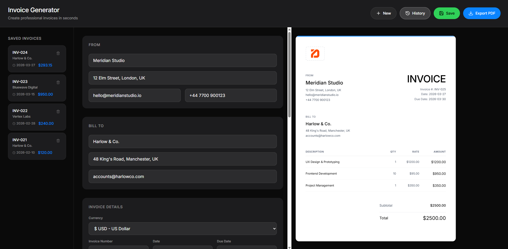
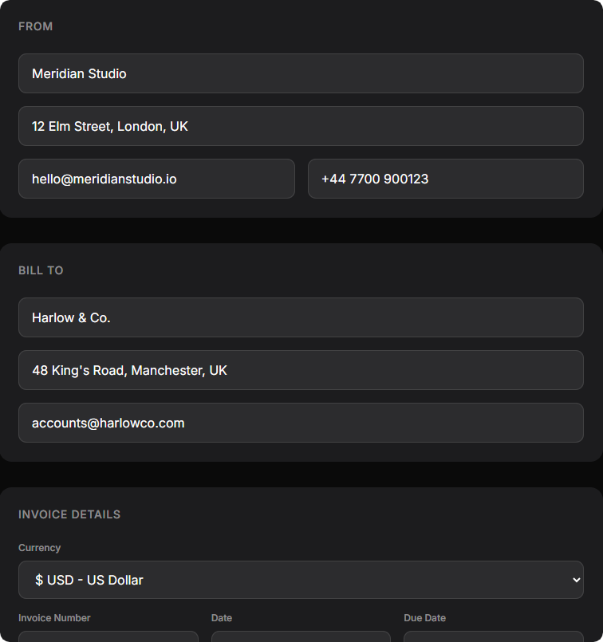
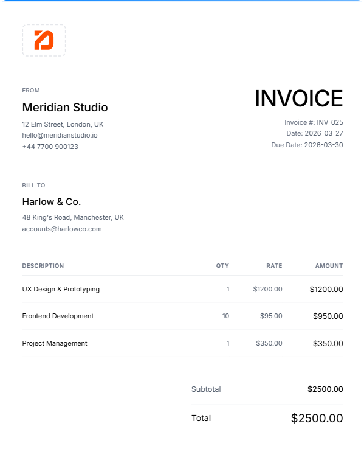
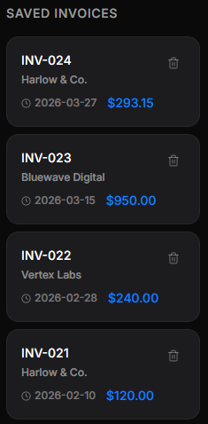

# Invoicr

> Create, preview, and export professional invoices in seconds.



## Overview

Invoicr is a full-stack invoice generator built for freelancers and small businesses. Fill in your details, add line items, and get a print-ready PDF — with all your invoices saved and accessible anytime.

Built with a spec-driven development workflow using the BMAD method, and AI-accelerated tooling.

## Features

- **Live preview** — invoice updates in real time as you type
- **PDF export** — clean, print-ready output
- **Logo upload** — personalize invoices with your brand
- **Multi-currency** — support for major currencies
- **Invoice history** — save, load, and manage past invoices
- **Tax calculation** — configurable tax rate per invoice

## Screenshots

| Editor | Invoice Preview |
|--------|----------------|
|  |  |



## Tech Stack

**Frontend**
- React + TypeScript
- Vite
- Tailwind CSS + shadcn/ui

**Backend**
- FastAPI (Python)
- Supabase (PostgreSQL)

**Deployment**
- Vercel (frontend)
- Render (backend)

## Getting Started

### Prerequisites
- Node.js 18+
- Python 3.10+
- A [Supabase](https://supabase.com) project

### Database Setup

Run the SQL schema in your Supabase SQL editor:

```sql
-- From supabase-schema.sql
```

Or copy and run `supabase-schema.sql` directly from the repo.

### Backend

```bash
cd backend
cp .env.example .env
# Fill in your Supabase credentials in .env
pip install -r requirements.txt
uvicorn main:app --reload
```

### Frontend

```bash
cp .env.example .env
# Fill in VITE_API_URL in .env
npm install
npm run dev
```

The app will be available at `http://localhost:5173`.

## Environment Variables

**Frontend (`.env`)**
```
VITE_API_URL=http://localhost:8000
```

**Backend (`backend/.env`)**
```
SUPABASE_URL=your-supabase-url
SUPABASE_KEY=your-anon-key
ALLOWED_ORIGINS=http://localhost:5173
```

## Deployment

- Frontend: deploy to [Vercel](https://vercel.com) — connect your GitHub repo and set `VITE_API_URL`
- Backend: deploy to [Render](https://render.com) — set environment variables in the dashboard

## Author

**Tudor Goian** — [github.com/VaruTudor](https://github.com/VaruTudor)

---

*Built with spec-driven development and AI-accelerated workflows.*